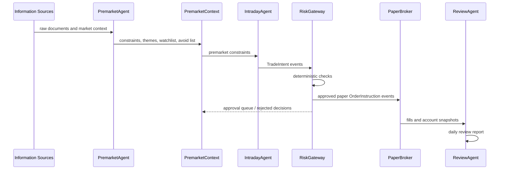
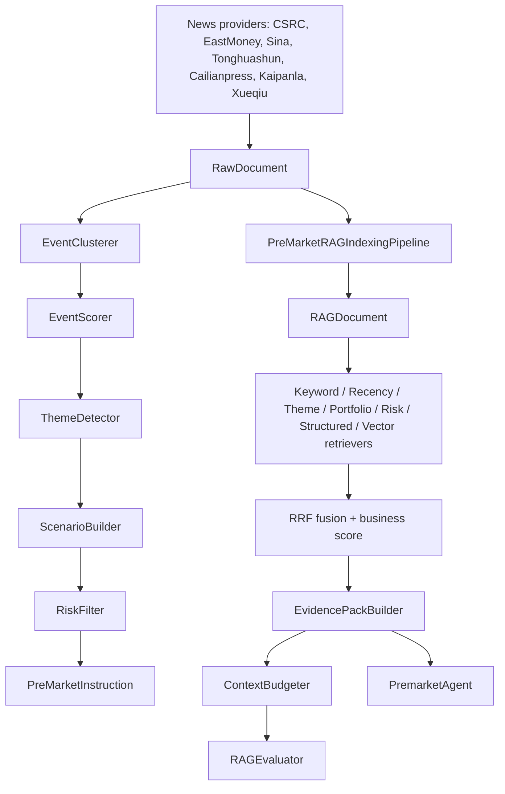
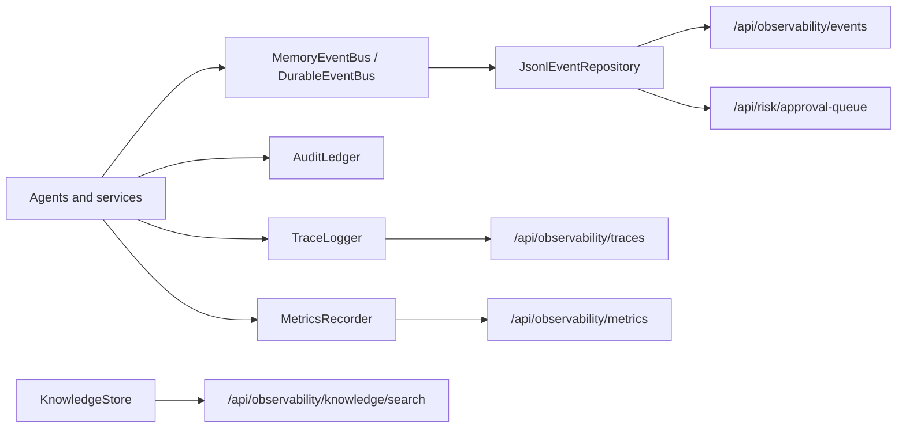

# A-Shares Agent Knowledge Graph

Generated on 2026-06-13 from the local repository on branch `codex/dev-knowledge-graph`.

## Executive Map

```mermaid
flowchart LR
  ExternalInfo["External information sources"] --> PremarketAgent["PremarketAgent"]
  MarketData["Market bars / quotes"] --> IntradayAgent["IntradayAgent"]

  PremarketAgent --> PremarketContext["PremarketContext"]
  PremarketAgent --> KnowledgeSystem["Premarket RAG + Knowledge Store"]
  KnowledgeSystem --> PremarketContext

  PremarketContext --> IntradayAgent
  IntradayAgent --> TradeIntents["trading.intents"]
  TradeIntents --> RiskGateway["RiskGateway"]
  RiskGateway --> RiskDecisions["risk.decisions"]
  RiskGateway --> ApprovalQueue["risk.approval_queue"]
  RiskDecisions --> OrderInstructions["orders.instructions"]
  OrderInstructions --> PaperBroker["PaperBroker"]
  PaperBroker --> Fills["orders.filled"]
  PaperBroker --> AccountState["account / position snapshots"]
  Fills --> ReviewAgent["ReviewAgent"]
  AccountState --> ReviewAgent
  ReviewAgent --> DailyReports["reports/daily"]

  PremarketAgent --> Events["Event Store"]
  IntradayAgent --> Events
  RiskGateway --> Events
  PaperBroker --> Events
  ReviewAgent --> Events
  Events --> Api["FastAPI Console API"]
  DailyReports --> Api
  Api --> WebConsole["React Web Console"]
```

## Major Nodes

| Node | Type | Code | Role |
| --- | --- | --- | --- |
| `PremarketAgent` | Agent | `trading_agent_system/agents/premarket_agent/agent.py` | Builds the premarket view, themes, catalysts, watchlist, avoid list, opening radar, and trading constraints. |
| `IntradayAgent` | Agent | `trading_agent_system/agents/intraday_agent/agent.py` | Reads market state and premarket context, then emits candidate intraday trade intents. |
| `RiskGateway` | Deterministic service | `trading_agent_system/core/risk_gateway/` | Applies safety checks and converts accepted intents into paper order instructions or approval queue items. |
| `PaperBroker` | Deterministic service | `trading_agent_system/core/broker/paper_broker.py` | Simulates order execution, fills, cash, and position snapshots. |
| `ReviewAgent` | Agent | `trading_agent_system/agents/review_agent/agent.py` | Reviews signal quality, execution quality, risk behavior, PnL, and intelligence quality. |
| `KnowledgeSystem` | Capability | `trading_agent_system/core/knowledge/`, `trading_agent_system/agents/premarket_agent/rag/` | Indexes, retrieves, fuses, and budgets evidence for premarket decisions. |
| `Event Store` | Infrastructure | `trading_agent_system/core/event_bus/`, `trading_agent_system/core/storage/repositories.py` | Persists JSONL events for agents, services, observability, and API views. |
| `FastAPI Console API` | API | `trading_agent_system/api/app.py` | Exposes run controls, reports, market data, premarket debug, observability, RAG debug, and approval queue endpoints. |
| `React Web Console` | Frontend | `web/src/` | Presents the paper-trading console, architecture view, premarket debug tab, market data, and observability views. |

## Trading Loop

## Premarket Knowledge Subgraph

## Runtime And Observability

## API Surface

| Area | Endpoints | Backing code |
| --- | --- | --- |
| Health and execution | `/api/health`, `/api/run/{job}`, `/api/run-all` | `trading_agent_system/api/app.py`, `scripts/run_*.py` |
| Reports | `/api/reports`, `/api/reports/{report_name}` | `reports/daily`, `reports/premarket` |
| Premarket | `/api/premarket/latest`, `/api/premarket/context`, `/api/premarket/rag/latest`, `/api/premarket/debug` | `PremarketContextLoader`, `JsonlEventRepository`, `KnowledgeStore` |
| Intraday | `/api/intraday/latest` | `intraday.analysis` event stream |
| Observability | `/api/observability/events`, `/api/observability/traces`, `/api/observability/metrics`, `/api/observability/knowledge/search` | event, trace, metric, and knowledge stores |
| Risk | `/api/risk/approval-queue`, `/api/decisions/traces` | risk decision events and approval queue events |
| Market data | `/api/market/quotes`, `/api/market/stocks` | Sina, EastMoney, and Tencent providers |
| RAG debug | `/api/rag/debug` | `RagRetriever`, `KnowledgeStore` |

## Configuration Sources

| Config | Purpose |
| --- | --- |
| `configs/app.yaml` | Top-level runtime paths, paper mode, market indexes, providers, watchlist, broker defaults, and subordinate config paths. |
| `configs/risk.paper.yaml` | Risk gateway switches, deterministic checks, position/exposure/loss/frequency constraints, and approval defaults. |
| `configs/premarket.yaml` | Premarket pipeline settings and provider behavior. |
| `configs/rag.premarket.yaml` | Premarket RAG indexing, retrieval, evaluation, and evidence settings. |
| `configs/strategy_registry.yaml` | Strategy registry and allowed strategy definitions. |
| `configs/symbols.watchlist.yaml` | Symbol universe and watchlist. |

## Safety Invariants

- The system is paper-trading only by default.
- `trading_enabled` defaults to `false`.
- Human approval is required by default.
- `RiskGateway` is deterministic and is not treated as a business agent.
- `PaperBroker` simulates execution and is not a real broker adapter.
- `IntradayAgent` emits intents; it does not publish direct order instructions.
- Review output is advisory and should not mutate strategy configuration.

## Hotspots

| Hotspot | Why it matters |
| --- | --- |
| `trading_agent_system/agents/premarket_agent/news_provider.py` | Integrates many public data providers and is likely to drift as upstream pages/APIs change. |
| `trading_agent_system/agents/premarket_agent/rag/` | Contains the highest-density knowledge pipeline: indexing, retrievers, fusion, evidence packs, and evaluation. |
| `trading_agent_system/core/risk_gateway/checks.py` | Safety-critical deterministic checks. Changes here affect order approval/rejection behavior. |
| `trading_agent_system/api/app.py` | Wide API surface used by the web console; failures here show up directly in the UI. |
| `web/src/main.jsx` and `web/src/api.js` | Main console workflows and client calls into the FastAPI API. |

